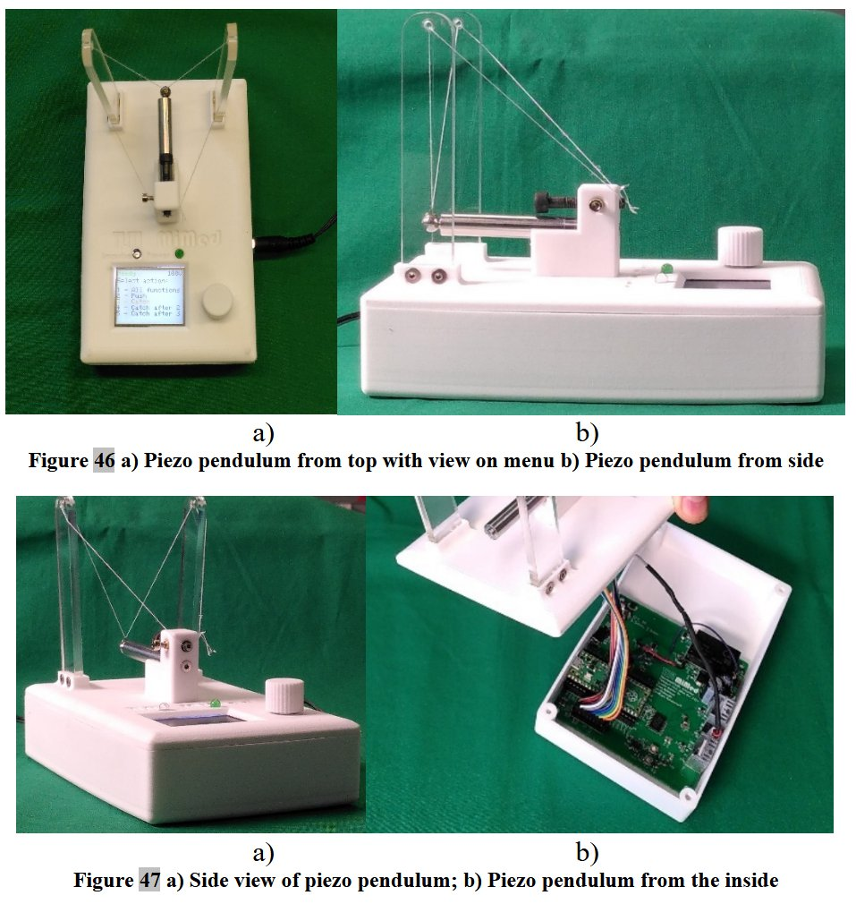

![[piezo animation]](assets/piezopendulum_animation.gif)
---

# The Self-Sensing Piezoelectric Pendulum

### Vision: Rescuing a Legacy Demonstrator

This project revitalizes a classic 1993 piezoelectric pendulum, a key educational tool at the Technical University of Munich. The original, while brilliant, was facing obsolescence due to aging electronics and inaccessible Assembler software. The vision was to engineer a modern, robust, and user-friendly successor that preserves its core teaching value for the next generation of engineers.

---

### Watch it in Action

The new demonstrator successfully replicates all key operations of the original, including self-sensing impulse detection, launching a suspended ball, and achieving a precise, bounce-free catch upon its return.

---

## Key Contributions & Features

*   **Complete Technological Overhaul:** Replaced 30-year-old electronics and Assembler code with a modern system based on a **Raspberry Pi Pico** and **C++**.
*   **Self-Sensing Actuation:** The piezo actuator itself detects the returning ball's impact, eliminating the need for external sensors.
*   **Precise Bounce-Free Catch:** The system calculates the exact moment to discharge the piezo's energy, causing the ball to "stick" to the actuator without bouncing.
*   **Integrated & Robust Design:** A compact, 3D-printed enclosure integrates the actuator and control unit, eliminating fragile external cables.
*   **Intuitive User Interface:** Simple rotary encoder and a clear LCD screen.

## Technical Breakdown

The project followed a clear modernization path:

1.  **Electronics Redesign:** A custom PCB was designed featuring a half-bridge configuration with fast-switching MOSFETs and a bootstrap gate driver to precisely control the high-voltage piezo actuator.
2.  **Intelligent Control:** A Raspberry Pi Pico runs the C++ firmware, handling user input, display updates, and the critical microsecond-level timing required for the bounce-free catch.
3.  **Physical Redesign:** The enclosure and actuator mount were designed in CAD and 3D printed, allowing for rapid prototyping and a compact, integrated final form.

---

## Read the Full Thesis

For a complete technical deep-dive, including schematics, code, and design evaluation, you can access the full bachelor's thesis.

**[Download the Thesis PDF](self-sensing_piezoelectrically_actuated_pendulum_julius_gun.pdf)**
